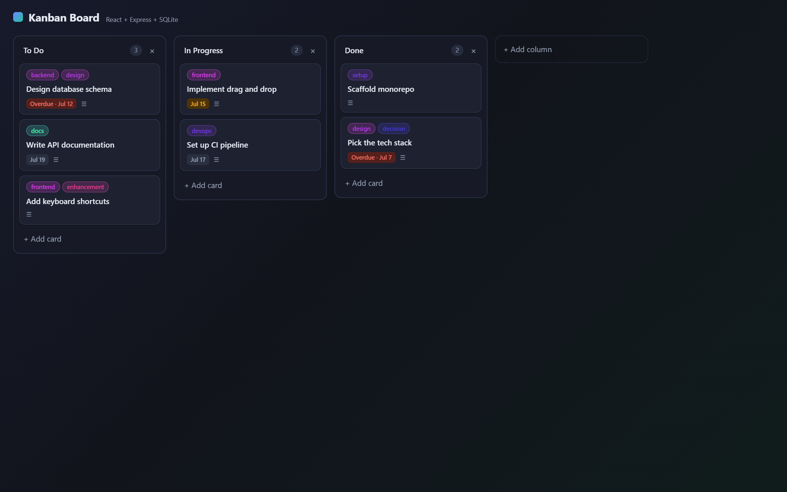

# Kanban Board

A full-stack drag-and-drop Kanban board. React on the front, a small REST API on the back, and a file-based SQLite database that seeds itself with a demo board on first run.

## Features

- Drag and drop cards within and between columns; drag columns to reorder the board
- Card detail modal: edit title, description, labels, and due date; delete cards
- Inline "add card" and "add column" flows; click a column title to rename it
- Due-date badges with overdue (red) and due-soon (amber) highlighting
- Colored label chips with a stable, deterministic color per label
- Optimistic UI updates with automatic re-sync from the server if a request fails
- Light and dark themes via `prefers-color-scheme`
- Persistent ordering: card position and column membership survive restarts

## Tech stack

| Layer    | Tech                                                                 |
| -------- | -------------------------------------------------------------------- |
| Client   | React 18, TypeScript, Vite, [@hello-pangea/dnd](https://github.com/hello-pangea/dnd) |
| Server   | Node.js, Express 4                                                    |
| Database | SQLite via [better-sqlite3](https://github.com/WiseLibs/better-sqlite3) (file-based, zero setup) |
| Tooling  | npm workspaces, concurrently                                          |

## Architecture

Monorepo with two npm workspaces:

```
kanban-board/
├── server/          Express REST API
│   ├── src/
│   │   ├── index.js         entry point (port 4000)
│   │   ├── app.js           Express app, error handling
│   │   ├── db.js            SQLite connection, schema, seed, move/reorder logic
│   │   ├── validate.js      input validation helpers, consistent 400 shape
│   │   └── routes/
│   │       ├── columns.js   column CRUD + reorder
│   │       └── cards.js     card CRUD + move
│   └── data/kanban.db       created automatically on first start (gitignored)
└── client/          React SPA (Vite dev server on port 5173)
    └── src/
        ├── api.ts           typed API client
        ├── types.ts         shared response types
        ├── App.tsx          board state, optimistic updates
        └── components/      Board, ColumnView, CardView, CardModal, …
```

The client never talks to SQLite directly — everything goes through the REST API. In development, Vite proxies `/api/*` to the Express server, so the app is served from one origin and no CORS configuration is needed.

Ordering is stored as a dense integer `position` per column and per card-within-column. Move and reorder endpoints rewrite positions transactionally so the persisted order always matches what the user sees.

Labels are stored as a JSON string array on the card row — simple, and plenty for a board of this size; a join table would be the next step if labels needed their own colors or renames.

## API

Base URL: `http://localhost:4000`. All responses are JSON. Validation failures return `400` with a consistent shape:

```json
{ "error": { "message": "Invalid card.", "details": ["\"title\" is required."] } }
```

| Method | Endpoint               | Description                                                        |
| ------ | ---------------------- | ------------------------------------------------------------------ |
| GET    | `/api/health`          | Liveness probe                                                     |
| GET    | `/api/board`           | Full board: ordered columns, each with its ordered cards           |
| GET    | `/api/columns`         | Same payload as `/api/board`                                       |
| POST   | `/api/columns`         | Create a column — body `{ "title": string }`                        |
| PATCH  | `/api/columns/:id`     | Rename a column — body `{ "title": string }`                        |
| DELETE | `/api/columns/:id`     | Delete a column and its cards                                      |
| PUT    | `/api/columns/reorder` | Persist column order — body `{ "columnIds": number[] }` (all ids)   |
| POST   | `/api/cards`           | Create a card — body `{ "columnId", "title", "description"?, "labels"?, "dueDate"? }` |
| GET    | `/api/cards/:id`       | Fetch a single card                                                |
| PATCH  | `/api/cards/:id`       | Edit `title` / `description` / `labels` / `dueDate`                |
| POST   | `/api/cards/:id/move`  | Move a card — body `{ "columnId": number, "index": number }`        |
| DELETE | `/api/cards/:id`       | Delete a card                                                      |

Card fields: `title` (required, ≤ 200 chars), `description` (≤ 5000), `labels` (≤ 10 strings, each ≤ 40 chars), `dueDate` (`YYYY-MM-DD` or `null`), `position` (managed by the server).

## Getting started

Requires Node.js 20+.

```bash
# from the repo root — installs server + client via npm workspaces
npm install

# run both servers (API on :4000, Vite on :5173)
npm run dev
```

Open http://localhost:5173. The SQLite database is created and seeded with a demo board on first start.

Other scripts (from the repo root):

```bash
npm run dev:server   # API only
npm run dev:client   # Vite only
npm run build        # type-check + production build of the client
npm start            # API without file watching
```

To reset the demo data, stop the server and delete `server/data/`.

## Screenshots




## Future work

- **Authentication and multi-user boards** — deliberately out of scope for this demo; the API is unauthenticated and single-board.
- Multiple boards with a board switcher
- Label management (rename, custom colors) via a join table
- Card search and filtering by label / due date
- Keyboard-driven card creation and navigation
- Automated tests (API integration tests + component tests)
